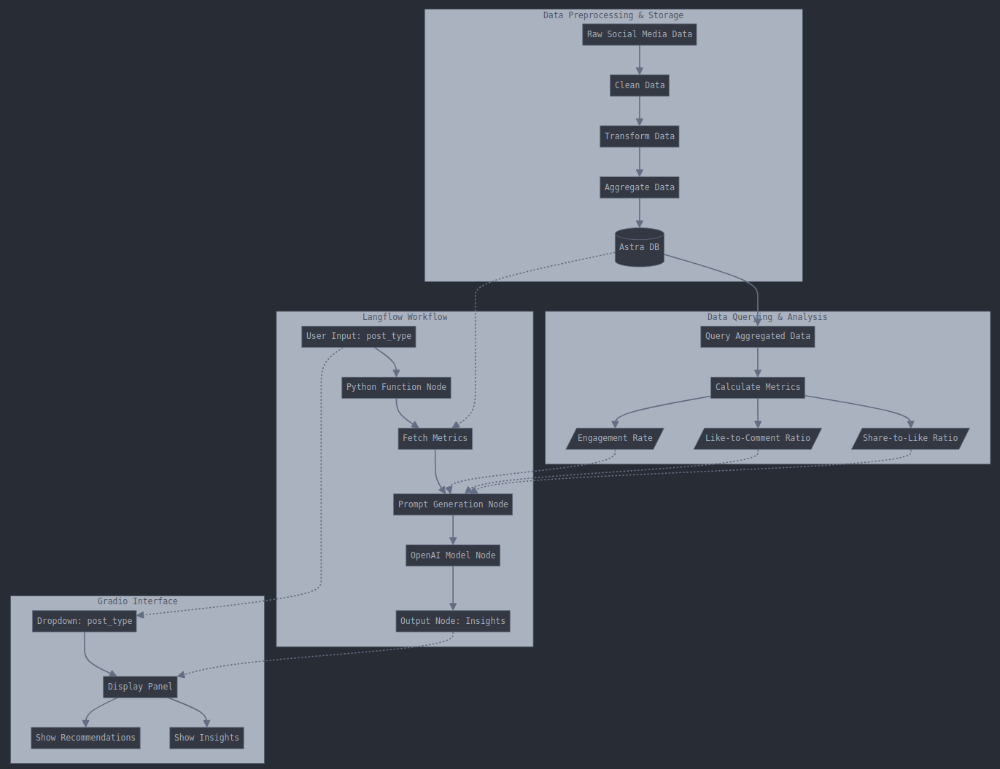

# Social Media Performance Analysis Project
## Team Name: **Edgy Coders**
### Team Members: 
- **[Vivek Shah](https://www.linkedin.com/in/the-cipher-vivek)**
- **[Bhagirath Patel](https://www.linkedin.com/in/bhagirath-patel-bhp)**
- **[Vraj Shah](https://in.linkedin.com/in/vrajshah113)**
- **[Aniket Patel](https://www.linkedin.com/in/aniket-patel-developer)**



## Introduction   

This project involves analyzing social media performance data using advanced tools and technologies, including Astra DB, Langflow, Python, and Gradio. The primary objective is to preprocess and store engagement data, query and analyze post performance metrics, and provide actionable insights via an interactive interface.

### **Tools and Technologies**
- **Astra DB**: For storing and querying data.
- **Langflow**: To design workflows for analysis and integrate OpenAI GPT for insights.
- **Python**: For data preprocessing and API scripting.
- **Gradio**: For building an interactive user interface.

---

## Data Preprocessing and Storage

### **Dataset Overview**
The primary dataset (`social_media_posts.csv`) contains raw engagement metrics, including:
- **Likes**
- **Shares**
- **Comments**
- **Post Type** (e.g., carousel, reels, static images)
- **Timestamp**

### **Preprocessing Steps**
1. **Data Cleaning**:
   - Checked for missing values and removed duplicates.
   - Formatted timestamps to ensure uniformity.
2. **Metrics Calculation**:
   - Derived key performance metrics, including:
     - **Engagement Rate**: Sum of likes, shares, and comments.
     - **Like-to-Comment Ratio**.
     - **Share-to-Like Ratio**.
3. **Data Aggregation**:
   - Grouped data by `post_type` to calculate averages for each metric.

### **Storing Data in Astra DB**
1. **Database Setup**:
   - Created a table in Astra DB to store the dataset.
   - Fields: `post_type`, `likes`, `shares`, `comments`, `timestamp`, and derived metrics.

2. **Data Insertion**:
   - Inserted preprocessed data into Astra DB using Python scripts.
   - Verified data integrity by querying random samples.

3. **Querying Data**:
   - Aggregated average engagement metrics for each `post_type`.
   - Used Python to query Astra DB and fetch insights dynamically.

---

## Post Analysis with Langflow

### **Langflow Workflow Design**
1. **Input Node**:
   - Accepts `post_type` as input.
2. **Python Function Node**:
   - Queries Astra DB and retrieves metrics for the specified `post_type`.
3. **Prompt Node**:
   - Constructs a detailed GPT prompt with metrics.
   - Example Template:
     ```plaintext
     Analyze the following data for social media post type: {post_type}.
     - Average Likes: {avg_likes}
     - Average Shares: {avg_shares}
     - Average Comments: {avg_comments}
     - Engagement Rate: {engagement_rate}
     - Like-to-Comment Ratio: {like_to_comment_ratio}
     - Share-to-Like Ratio: {share_to_like_ratio}
     Provide actionable recommendations to improve engagement.
     ```
4. **OpenAI Model Node**:
   - Sends the prompt to GPT and receives insights.
5. **Output Node**:
   - Displays the recommendations.

### **Langflow Integration**
- Exported the workflow as JSON.
- Used Python scripts to dynamically pass user input (`post_type`) and fetch results from the Langflow API.

---

## Building a Gradio Interface

### **Objective**
Provide an interactive platform where users can select a `post_type` and view detailed analysis and recommendations.

### **Steps**
1. **Setup**:
   - Installed Gradio using `pip install gradio`.
2. **Interface Design**:
   - Input: Dropdown menu to select `post_type`.
   - Output: Display GPT-generated insights.
3. **Integration**:
   - Connected the Gradio interface to the Langflow API via Python.

### **Example Code**
```python
import gradio as gr

def analyze_post_type(post_type):
    # Call Langflow API to get insights
    insights = get_post_type_analysis(post_type)  # Function to interact with Langflow
    return insights

interface = gr.Interface(
    fn=analyze_post_type,
    inputs=gr.Dropdown(["carousel", "reels", "poll", "static images", "stories", "live stream"]),
    outputs="text",
    title="Social Media Post Analysis",
    description="Select a post type to analyze its performance and receive actionable recommendations."
)

interface.launch()
```

---

## Conclusion and Key Results

### **Insights from Analysis**
- **Reels** and **Stories** had the highest engagement rates.
- **Polls** encouraged active participation but lacked shareability.
- **Carousel** posts performed well in comments but could benefit from more shares.

### **Recommendations**
1. Focus on creating engaging **reels** and **stories** for maximum reach.
2. Use trending topics in **polls** to boost shareability.
3. Leverage visually appealing **carousel** posts with CTAs to drive interaction.

### **Future Work**
- Incorporate sentiment analysis to enhance insights.
- Automate periodic data ingestion and analysis using Astra DB triggers.
- Extend the Gradio interface with charts and visualizations.

